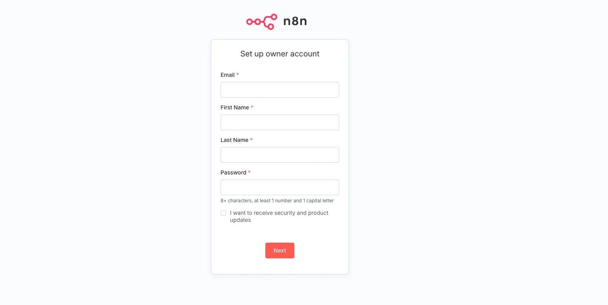
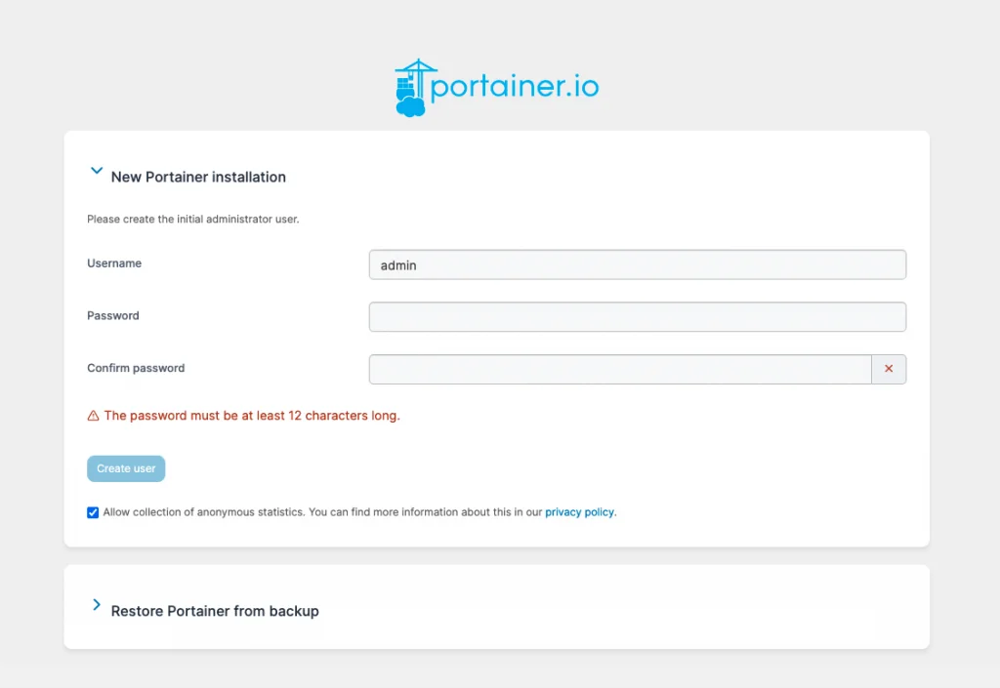

# Instalación Automática de Docker, Docker Compose, n8n y Portainer

Este repositorio proporciona un script Bash (`install.sh`) para instalar y configurar Docker, Docker Compose plugin, n8n y Portainer en servidores basados en Ubuntu.

## Requisitos previos

- Sistema operativo: Ubuntu 18.04, 20.04, 22.04, 24.04 (u otra versión compatible con los repositorios oficiales de Docker)
- Acceso con usuario que tenga privilegios de sudo
- Conexión a Internet desde el servidor

## Contenido del repositorio

- `install.sh`: script que automatiza la instalación.

### 1. Descargar o clonar el repositorio

```bash
git clone https://github.com/devalexcode/shell-n8n-portainer.git
```

### 2. Ingresa a la carpeta del proyecto

```bash
cd shell-n8n-portainer
```

### 3. Crea el archivo `.env`

```bash
cp .env.example .env
```

**3.1 ⚙️ Configuración del archivo `.env`**

Antes de levantar los servicios, asegúrate de crear y configurar tu archivo `.env`:

```bash
nano .env
```

Edita el archivo `.env` con tus propios valores:

```dotenv
# -------------------- n8n --------------------

# URL de conexión a n8n:
N8N_URL="https://dominio.com" # REMPLAZA ESTE VALOR

# Puerto donde se expone la interfaz web de n8n
N8N_PORT=5678

# Zona horaria para n8n (asegúrate de usar la sintaxis de TZ válida)
N8N_TIME_ZONE="America/Mexico_City"

# -------------------- Portainer --------------------

# Puerto donde se expone el panel de Portainer
PORTAINER_PORT=9000

```

### 4. Dar permisos de ejecución al script

```bash
chmod +x install.sh
```

### 5 Ejecutar el script

```bash
./install.sh
```

- El script actualizará el sistema, instalará Docker y sus herramientas, añadirá el usuario al grupo `docker` desplegará n8n y Portainer.

## Ingresar a n8n

Al finalizar, verás un mensaje indicando la URL de acceso a Portainer:

```bash
n8n instalado y accesible en: N8N_URL
```



## Ingresar a Portainer

Al finalizar, verás un mensaje indicando la URL de acceso a Portainer:

```bash
Portainer instalado y accesible en: http://<IP_DEL_SERVIDOR>:9000
```



¡Listo! Con estos pasos tu servidor quedará preparado para gestionar contenedores Docker a través de Portainer.

## 👨‍💻 Autor

Desarrollado por [Alejandro Robles | Devalex ](http://devalexcode.com)  
¿Necesitas que lo haga por ti? ¡Estoy para apoyarte! 🤝 https://devalexcode.com/soluciones/n8n-en-servidor-vps

¿Dudas o sugerencias? ¡Contribuciones bienvenidas!
